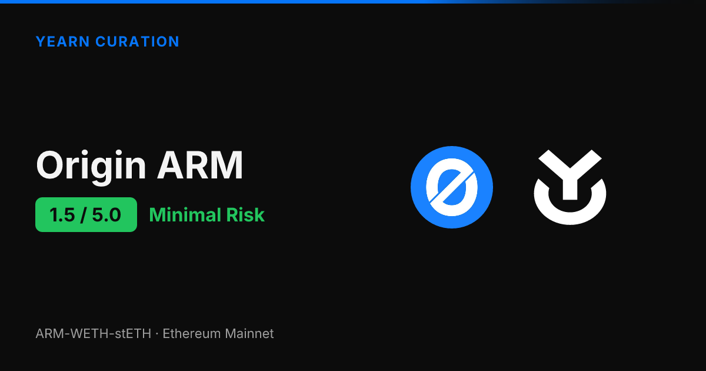
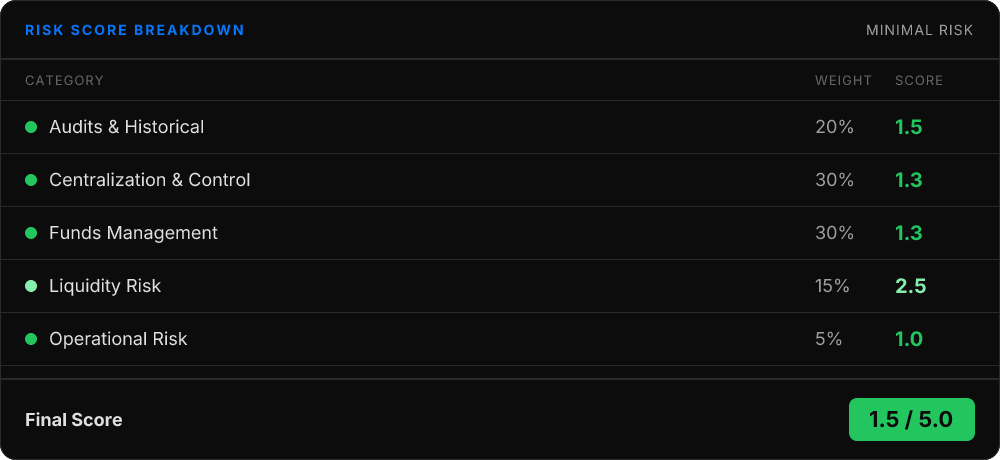
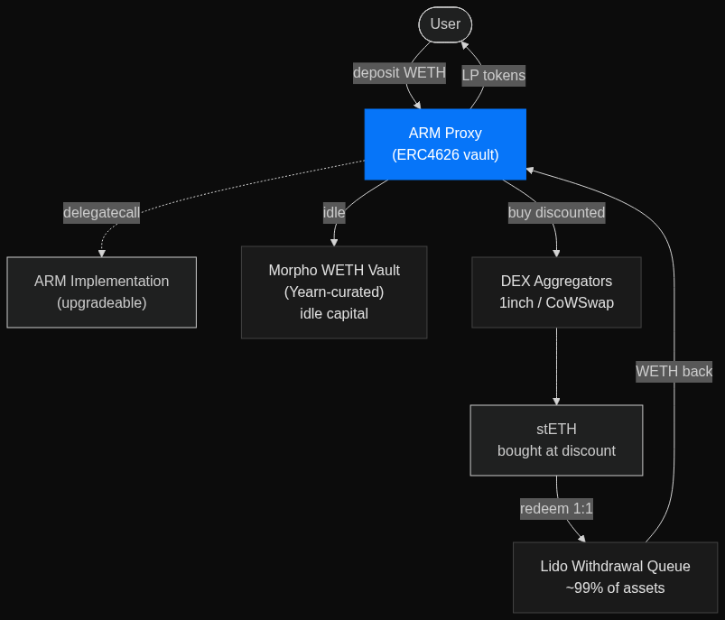
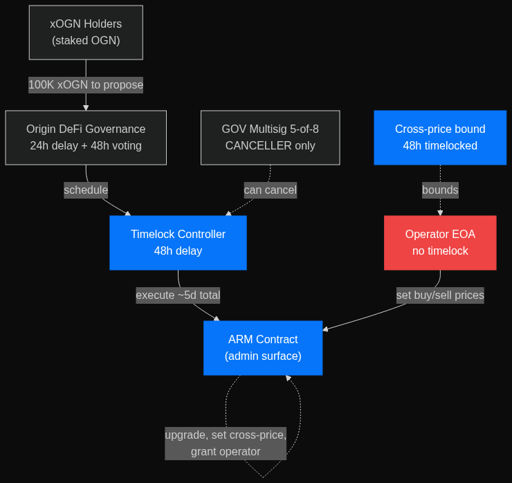
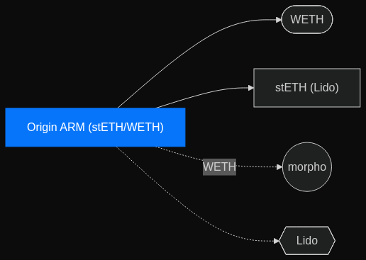

<!--
Source: reports/report/origin-arm.md
Generated: April 21, 2026
Score: 1.50/5.0
Tier: Minimal Risk
Word count: ~1450
-->

# Origin ARM: Risk Assessment Deep Dive

*Published by Yearn Curation | February 8, 2026*

Origin ARM scores **1.5 out of 5.0**, placing it in the **Minimal Risk** tier — approved with high confidence. This is one of the strongest scores in our framework, driven by fully onchain governance, multiple independent audits, and a straightforward strategy built around ETH-denominated assets.

The biggest strength is Origin's onchain governance structure with a roughly five-day execution cycle and no admin backdoor. The primary concern is the operator role, held by a single externally owned account rather than a multisig — though its powers are bounded by a 48-hour timelocked cross-price.

## What Is Origin ARM?

Origin's stETH ARM — short for Automated Redemption Manager — is a yield-generating ETH vault built on the ERC4626 standard. The strategy is elegantly simple: the protocol buys stETH at a discount on the open market, then redeems it 1:1 for ETH through Lido's withdrawal queue, capturing the spread as yield.

When you deposit WETH, you receive ARM-WETH-stETH LP tokens representing your share of the vault. The protocol launched in October 2024 and has been operating for roughly 16 months without any security incidents.

It's built by Origin Protocol, a team active in DeFi since 2017 and backed by Pantera Capital and Founders Fund. Beyond the stETH arbitrage, idle capital can be deployed to a Morpho lending market curated by Yearn, adding a second yield layer. Origin charges a 20% performance fee on generated yield.

## Security Profile

Origin ARM has undergone three independent security reviews. OpenZeppelin audited the ARM contracts twice — once in November 2024 at launch and again in June 2025 — while Certora performed formal verification in December 2024.

Formal verification is a particularly strong signal. It provides mathematical proof that the smart contracts behave according to their specification, going well beyond what traditional audits cover. The broader Origin organization has accumulated over 30 audit reports across its products, all publicly available in their [security repository](https://github.com/OriginProtocol/security).

A $1,000,000 bug bounty is active on Immunefi with the ARM contract explicitly in scope. It's worth noting that Origin Protocol did experience a significant security incident in November 2020 — an $8M flash loan reentrancy attack on their OUSD product. That involved a completely different codebase, and the ARM contracts were built years later with those lessons incorporated.

## How Your Funds Are Managed

When you deposit WETH into Origin ARM, the vault uses those funds to buy discounted stETH and submit it to Lido's withdrawal queue for 1:1 redemption. Roughly 99% of the vault's assets sit in the Lido queue at any given time, with a small WETH buffer for immediate withdrawals.

Deposits are permissionless and atomic — you send WETH and immediately receive LP tokens. Withdrawals are a two-step process: request (which locks your price-per-share and burns your shares immediately), then claim after a minimum 10-minute delay. If your withdrawal exceeds the WETH buffer, you wait for Lido's queue, typically one to three days.

All reserves are 100% onchain and verifiable. There's no offchain collateral, no leverage, and no liquidation mechanics. Your backing is entirely in same-value ETH-denominated assets, which significantly reduces collateral mismatch risk.

> For the full contract and fund-flow picture, see **Appendix A** below.

## Centralization and Control

Origin ARM's governance is one of its strongest features. All admin-level changes flow through an onchain process that takes approximately five days from proposal to execution. Token holders stake OGN to receive xOGN, which grants voting power.

Proposals require 100,000 xOGN to submit and pass through a voting delay, a voting period, and finally a 48-hour Timelock before execution. A 5-of-8 multisig exists but can only *cancel* proposals — it cannot propose or execute changes on its own.

The one area of concern is the operator role, which is held by a single externally owned account rather than a multisig. The operator can adjust the buy and sell prices used by the vault without going through the timelock. That power is bounded by a "cross-price" parameter that can only be changed by the full governance process, effectively capping any pricing manipulation.

The contract is upgradeable through a proxy pattern, but any upgrade must go through the full five-day governance cycle. There is no admin backdoor or emergency override that could bypass this process.

> The full control chain — who can do what, and on what delay — is laid out in **Appendix B**.

## Dependencies and Risks

Origin ARM has a critical dependency on Lido — the entire value proposition depends on Lido's stETH and its withdrawal queue functioning correctly. If Lido experienced a major failure, ARM operations would halt. That said, Lido is the largest liquid staking protocol in DeFi, which makes this a calculated dependency on well-established infrastructure rather than an experimental one.

The secondary dependency is Morpho, where idle capital gets deployed through a Yearn-curated vault. The Yearn curation layer adds meaningful risk management compared to the previous MEV Capital setup. Non-critical dependencies on 1inch and CoWSwap for stETH acquisition exist but aren't required for core functionality.

> See **Appendix C** for the full dependency graph.

## Liquidity: Can You Get Out?

If you need to exit, your experience depends on the size of your withdrawal relative to the vault's WETH buffer. Small withdrawals can be claimed after just a 10-minute delay. Larger withdrawals that exceed the buffer require waiting for Lido's withdrawal queue, typically one to three days.

Your price-per-share is locked at the moment you request the withdrawal, so there's no slippage risk while waiting. Because the vault holds same-value assets (ETH and stETH), the risk of value erosion during the wait is minimal. There is no secondary DEX liquidity for the LP token itself, so the vault's redemption mechanism is the only exit path. TVL has shown significant volatility historically — ranging from $782K to a $28M peak — which suggests whale concentration.

## The Bottom Line

Origin ARM is a well-constructed, conservatively designed vault that earns yield through a straightforward stETH arbitrage strategy. The onchain governance cycle, multiple OpenZeppelin audits plus Certora formal verification, and a $1M bug bounty contribute to an exceptionally strong security posture.

The main risk factors — a single-EOA operator and significant TVL volatility — are meaningful but well-mitigated. The operator's pricing power is bounded by the timelocked cross-price, and the same-value asset design limits the damage any pricing manipulation could cause.

With a final score of **1.5/5.0**, Origin ARM earns a **Minimal Risk** rating and is approved with high confidence. It's a suitable allocation for strategies prioritizing safety, particularly given the strong governance guarantees and the simplicity of the underlying yield mechanism.

---

## Appendix

### A. Contract Architecture

User deposits flow into the ARM Proxy, which delegates logic to an upgradeable implementation. The proxy buys discounted stETH through DEX aggregators, submits it to Lido's withdrawal queue for 1:1 redemption, and routes idle capital to a Yearn-curated Morpho vault.

### B. Governance and Control Chain

xOGN holders propose changes that flow through a ~5-day governance cycle ending at a 48-hour Timelock. The GOV Multisig can only cancel. The Operator EOA sits outside that chain and can adjust buy/sell prices with no delay — bounded by the cross-price, which is itself 48-hour timelocked.

### C. External Dependencies

Origin ARM has one critical dependency (Lido) and one supporting integration (Morpho, Yearn-curated). DEX aggregators are non-critical.

---

*This assessment is part of Yearn's ongoing curation work. For the complete technical report — including contract addresses, detailed scoring rubrics, and monitoring setup — visit the [full report on curation.yearn.fi](https://curation.yearn.fi/report/origin-arm).*
