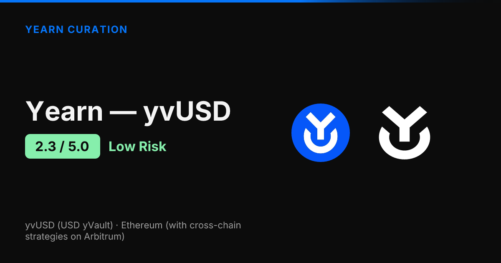
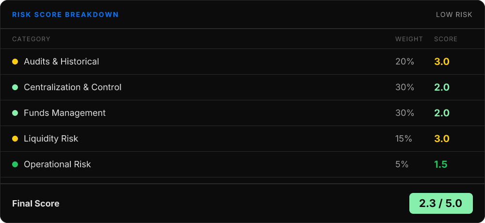
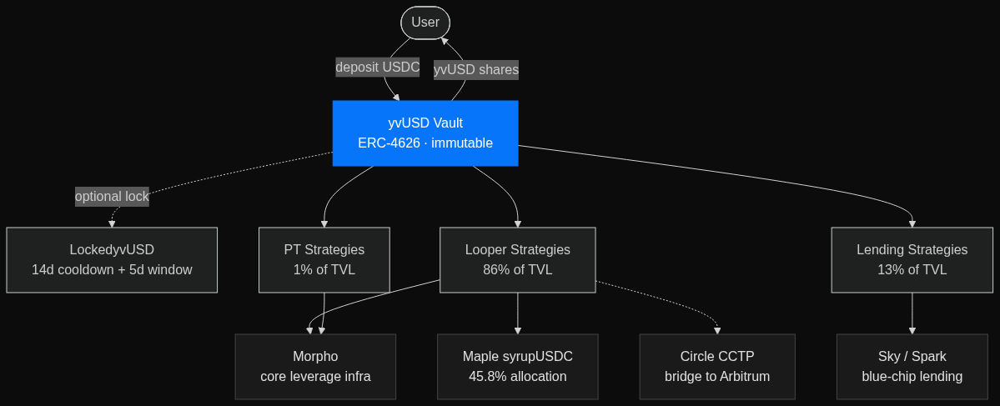
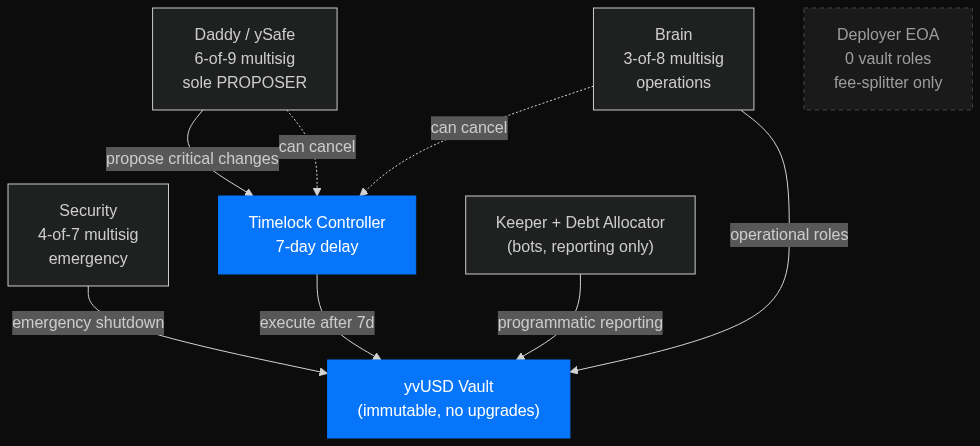

<!--
Source: reports/report/yearn-yvusd.md
Generated: April 21, 2026
Score: 2.30/5.0
Tier: Low Risk
Word count: ~1500
-->

# Yearn yvUSD: Risk Assessment Deep Dive

*Published by Yearn Curation | April 3, 2026*

Yearn's yvUSD scores **2.3 out of 5.0**, placing it in the **Low Risk** tier — approved with standard monitoring. This is an upgrade from the March assessment (2.6), driven by the vault's migration to Yearn's standard V3 governance pattern and a meaningful shift away from medium-risk dependencies.

The biggest strength is the now-mature governance setup: a 7-day timelock, a 6-of-9 multisig with publicly known signers as the sole proposer, and no EOA holding any vault role. The primary concern is that yvUSD is still early — ~74 days in production with $4M of TVL and roughly 86% of funds deployed into leveraged "looper" strategies that have not yet been stress-tested.

## What Is yvUSD?

yvUSD is a USDC-denominated Yearn V3 vault that puts deposited USDC to work across eleven different yield strategies, spanning both Ethereum and Arbitrum. Because it's ERC-4626, deposits and withdrawals follow the standard vault interface — you send USDC and receive yvUSD shares that appreciate as the vault earns yield.

The vault launched in January 2026 and currently holds about $4M against a $5M deposit cap, with a net APY of 4.32%. Price-per-share has climbed from 1.000000 to 1.006961 over roughly 74 days, all through onchain profit reporting.

What makes yvUSD architecturally interesting is its cross-chain design. Rather than deploying full Yearn V3 infrastructure to every chain, it uses Circle's CCTP bridge to send USDC to remote strategies on Arbitrum, which then report accounting back over the same channel. An optional companion contract called **LockedyvUSD** lets depositors lock their shares for 14 days in exchange for a bonus share of yield — useful for users who don't need atomic liquidity and want to help the vault underwrite longer-duration strategies.

## Security Profile

The underlying Yearn V3 framework has been audited by three independent firms: **Statemind**, **ChainSecurity**, and **yAcademy**, all in 2024. V3 has been live for about 23 months across 37+ vaults with no framework-level exploits.

yvUSD-specific components — the cross-chain `CCTPStrategy` and the `LockedyvUSD` cooldown wrapper — have not received dedicated external audits. They have, however, undergone strict internal review by **ySec**, Yearn's internal security team, and every strategy passes through Yearn's 12-metric risk scoring framework that covers code coverage, complexity, centralization, and protocol integration before it can be added to the vault.

A $200,000 Immunefi bug bounty and a Sherlock bounty both cover V3 vault code. Yearn has also set up active monitoring — hourly large-flow alerts via GitHub Actions and Telegram, weekly endorsed-vault checks, and timelock monitoring across six chains.

## How Your Funds Are Managed

When you deposit USDC, it flows immediately into one of yvUSD's eleven strategies — the vault currently runs at 100% deployment with zero idle funds. Strategies fall into four buckets: **looper strategies** (86% of TVL) that borrow USDC on Morpho against yield-bearing collateral like Maple syrupUSDC and InfiniFi siUSD, **lending strategies** (13%) that deposit into Sky and Spark, **PT strategies** (1%) holding Pendle Principal Tokens, and **cross-chain strategies** that bridge via CCTP to Arbitrum.

Profits are reported by keepers on each strategy's `report()` call and unlock linearly over seven days to prevent PPS manipulation. If you want extra yield and don't need immediate liquidity, you can lock your yvUSD in LockedyvUSD for a 14-day cooldown followed by a 5-day withdrawal window. The lock gives the vault stronger duration guarantees, which lets it underwrite higher-yielding strategies without forcing everyone else into the same constraint.

All reserves are 100% onchain and verifiable via standard ERC-4626 view functions, including cross-chain positions once CCTP messages have settled.

> For the full contract and fund-flow picture, see **Appendix A** below.

## Centralization and Control

Since March, yvUSD has completed its migration to the standard Yearn V3 governance pattern — the same framework used by yvUSDC-1 and 37+ other Yearn vaults. Critical operations (adding strategies, changing the accountant, raising max debt) flow through a **7-day TimelockController**, up from the 24-hour delay used during launch.

Three multisigs share the rest of the control surface: **Daddy/ySafe** (6-of-9, with publicly named signers including Mariano Conti, Leo Cheng, 0xngmi, and Michael Egorov) is the sole proposer and executor on the timelock; **Brain** (3-of-8) handles day-to-day operations and can cancel pending timelock proposals; **Security** (4-of-7) holds emergency roles. Two automated bots — the Keeper and the Debt Allocator — handle routine reporting and rebalancing.

Critically, the vault contract is **immutable** — V3 vaults cannot be upgraded. The timelock is self-governed (it holds its own admin role), DEFAULT_ADMIN was never granted, and the deployer EOA has confirmed zero vault roles. The only lingering concern is that the deployer retains governance of a Fee Splitter contract that handles revenue distribution, which is low-impact but still deviates from the multi-sig pattern applied elsewhere.

> The full control chain — who can do what, and on what delay — is laid out in **Appendix B**.

## Dependencies and Risks

yvUSD touches eight or more distinct protocols, but the dependency picture has improved materially in the last month. **Morpho** remains the critical infrastructure layer under roughly 86% of strategies — it's the borrowing rail for every looper. Morpho itself is about as blue-chip as DeFi gets, with $6.6B TVL, 25+ audits, and Certora formal verification, but concentration here is still the highest single-point-of-failure in the system.

The largest collateral exposure is **Maple syrupUSDC** at 45.8% of the vault, assessed internally at Low Risk (2.33/5). This is a significant improvement from March, when the dominant allocations were in medium-risk protocols — total medium-risk exposure has dropped from 65.6% to 16.4%, with InfiniFi sitting at 15.2% and 3Jane USD3 reduced to just 1.2%. Sky, Spark, and Fluid provide blue-chip lending cover. Cross-chain strategies ride on Circle's CCTP, which carries the same trust assumption as holding USDC itself.

The two risks that remain pointed: a Maple failure would hit nearly half the vault, and a collateral depeg in a looper strategy could trigger cascading liquidations across multiple positions at once.

## Liquidity: Can You Get Out?

Exits use the standard ERC-4626 `withdraw()` / `redeem()` path, but because the vault runs at 100% deployment, your withdrawal triggers strategy unwinding rather than a simple idle-funds transfer. Lending strategies can unwind almost immediately; looper strategies need to deleverage on Morpho, which may take multiple transactions; cross-chain strategies have to wait for CCTP attestations to bridge USDC back from Arbitrum.

The vault is USDC-denominated, so there's no price-divergence risk on the underlying — one yvUSD always redeems for its fair share of USDC. There is no secondary DEX market for yvUSD, so the redemption mechanism is your only exit. About 70% of total supply is locked in LockedyvUSD at any given time, which effectively reduces the "competing" liquidity pool during normal operation. At the vault's current ~$4M scale, withdrawal amounts are small in absolute terms; this changes as TVL grows toward the $5M cap.

## The Bottom Line

yvUSD is a maturing Yearn V3 vault that has just completed a meaningful governance upgrade and quietly improved the quality of its underlying protocol mix. The combination of three independent V3 audits, a rigorous internal strategy review framework, a 7-day timelock, and battle-tested multi-sig governance gives it a stronger control posture than most 74-day-old vaults ever reach.

The remaining risks are real but well-characterized: the vault is still early, there's no external audit on the yvUSD-specific code, and a concentrated leverage posture (86% looper, 45.8% in Maple) means a single bad day in the wrong place could hurt. Active monitoring and the $5M deposit cap keep these risks bounded for now.

At **2.3/5.0 (Low Risk)**, yvUSD is approved with standard monitoring — a suitable allocation for strategies that can tolerate some leverage and concentration in exchange for V3 vault infrastructure backed by mature governance. We'll reassess as the vault crosses six months in production or if TVL moves significantly in either direction.

---

## Appendix

### A. Contract Architecture

User deposits flow into the immutable yvUSD Vault, which routes USDC to three strategy groups — looper, lending, and PT. Looper strategies do the heaviest lifting, borrowing USDC on Morpho against yield-bearing collateral (Maple syrupUSDC, InfiniFi siUSD) and also branching to Arbitrum via Circle CCTP. Users who want bonus yield can optionally lock their shares in LockedyvUSD with a 14-day cooldown.

### B. Governance and Control Chain

Daddy (6-of-9) is the sole proposer of timelocked changes; Brain (3-of-8) and Daddy can both cancel. Normal operational roles sit on Brain, emergency roles on Security (4-of-7), and routine reporting on automated bots. The Deployer EOA is intentionally isolated — it holds zero vault roles and only governs a Fee Splitter contract unrelated to fund custody.

---

*This assessment is part of Yearn's ongoing curation work. For the complete technical report — including contract addresses, detailed scoring rubrics, and monitoring setup — visit the [full report on curation.yearn.fi](https://curation.yearn.fi/report/yearn-yvusd).*
