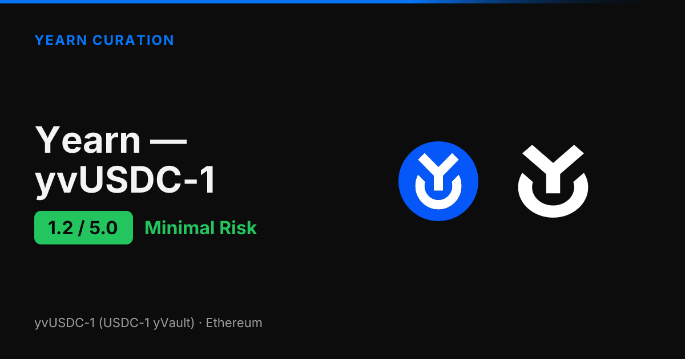
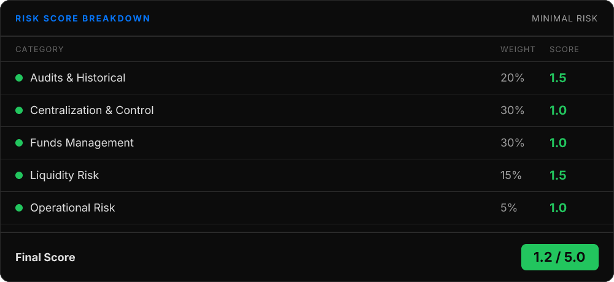
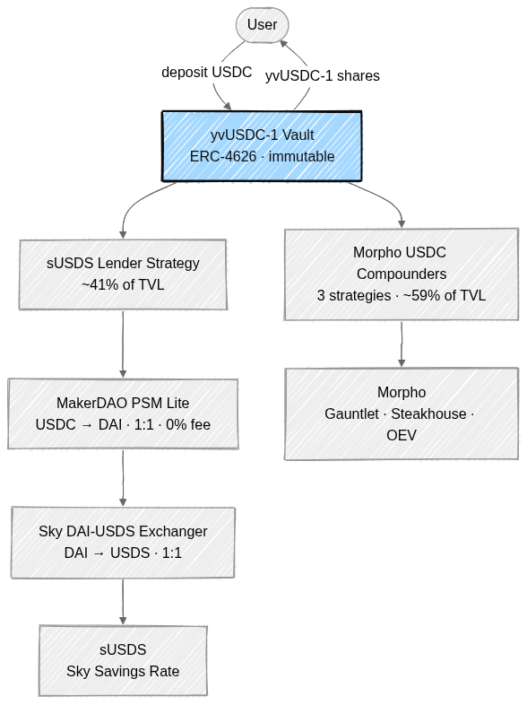
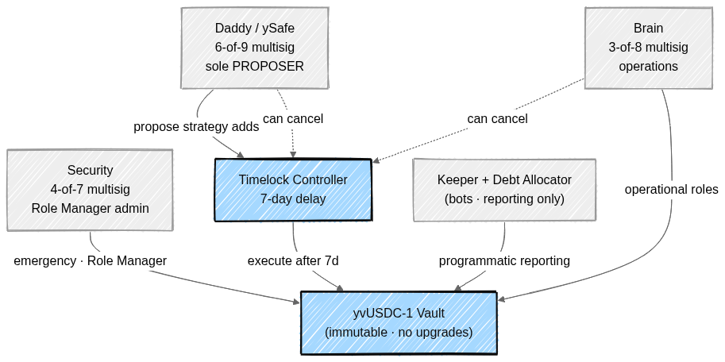

<!--
Source: reports/report/yearn-yvusdc.md
Generated: April 21, 2026
Score: 1.20/5.0
Tier: Minimal Risk
Word count: ~1450
-->

# Yearn yvUSDC-1: Risk Assessment Deep Dive

*Published by Yearn Curation | April 3, 2026*

Yearn's yvUSDC-1 scores **1.2 out of 5.0**, placing it firmly in the **Minimal Risk** tier — approved with high confidence. This is one of the strongest scores in our framework, earned through blue-chip-only dependencies, zero leverage, and the same battle-tested Yearn V3 governance pattern used across 37+ other vaults.

The biggest strength is the simplicity of the underlying strategy mix: roughly 41% goes into Sky's sUSDS via the Sky Savings Rate, and roughly 59% sits in Morpho USDC compounders. Both are top-tier DeFi infrastructure with extensive audit coverage and multi-billion dollar TVL. The primary concern is concentration — those two protocols carry the entire vault between them.

## What Is yvUSDC-1?

yvUSDC-1 is a USDC-denominated Yearn V3 vault that earns yield by routing deposits into a small set of conservative strategies on Ethereum. Because it's ERC-4626, deposits and withdrawals follow the standard interface — you send USDC and receive yvUSDC-1 shares that appreciate as the vault earns.

The vault launched in March 2024 and has been running for about 13 months, with TVL currently around $31.26M against a $50M deposit cap. Price-per-share has climbed from 1.000000 to 1.101404 — roughly 10.1% cumulative return, or about 9.4% annualized after the 10% performance fee.

What sets yvUSDC-1 apart from its sibling yvUSD is what's *missing*: no leverage, no looping, no cross-chain bridging, no PT tokens. The strategy menu is deliberately simple — lend USDC into Sky's savings rate, or compound it through Morpho. Yearn keeps nine strategies in the queue (including dormant Aave V3, Spark, and Fluid options) but currently funds only four.

## Security Profile

The underlying Yearn V3 framework has been audited by three independent firms: **Statemind**, **ChainSecurity**, and **yAcademy**, all in 2024. V3 has been live for about 23 months across 37+ vaults with no framework-level exploits.

The underlying yield protocols have remarkably deep audit coverage. **Sky / MakerDAO** — one of DeFi's oldest protocols — has been audited by ChainSecurity (9 audits), Cantina (10 reports including dedicated sUSDS coverage), Sherlock, Trail of Bits, and others. **Morpho** has 25+ audits from Trail of Bits, Spearbit, OpenZeppelin, ChainSecurity, and Certora, plus formal verification.

Bug bounty coverage is exceptional. Yearn's $200,000 Immunefi bounty (with an 18-hour median resolution time) covers V3 vault code, while Sky's separate **$10,000,000** Immunefi bounty covers DAI, USDS, sUSDS, and the PSM contracts. Every Yearn strategy passes through the 12-metric internal review run by ySec before it can take vault funds.

## How Your Funds Are Managed

Deposits flow into the immutable yvUSDC-1 vault, which currently runs at 100% deployment across two strategy groups. Roughly 41% goes to the **sUSDS Lender Strategy**: USDC is converted to DAI via MakerDAO's PSM Lite at 1:1 with zero fee, then to USDS via Sky's DAI-USDS Exchanger at 1:1, and finally deposited into sUSDS to earn the Sky Savings Rate (currently ~4.0% APY).

The remaining 59% sits in **three Morpho USDC compounders** — Gauntlet, Steakhouse, and OEV-boosted — which deposit USDC directly into Morpho lending vaults. There are no extra hops, no leverage, and no derivative tokens. Profits are reported by keepers and unlock linearly over 10 days to prevent PPS manipulation; losses are reflected immediately.

There's no cooldown or lock period, no withdrawal fees, and no DEX dependency for exits. Withdrawals reverse the same pipeline atomically: Morpho positions are redeemed directly, while sUSDS positions unwind through USDS → DAI → USDC. If the PSM ever charges fees above 0.05%, the strategy has a Uniswap V3 fallback at 0.5% slippage — but the PSM has held at 0% throughout the vault's history.

> For the full contract and fund-flow picture, see **Appendix A** below.

## Centralization and Control

yvUSDC-1 uses the standard Yearn V3 governance pattern — the same framework that runs yvUSD, yvUSDS, and 37+ other Yearn vaults. Critical operations like adding new strategies flow through a **7-day TimelockController**, with the delay raised from 24 hours to 7 days in early 2025.

Three multisigs share the rest of the control surface. **Daddy/ySafe** (6-of-9, with publicly named signers including Mariano Conti, Leo Cheng, 0xngmi, and Michael Egorov) is the sole proposer and executor on the timelock. **Brain** (3-of-8) handles operational roles and can cancel pending timelock proposals. **Security** (4-of-7) administers the Role Manager and holds emergency powers. Two automated bots — the Keeper and the Debt Allocator — handle routine reporting and rebalancing.

The vault contract itself is **immutable** — V3 vaults cannot be upgraded. The timelock is self-governed (it holds its own admin role), DEFAULT_ADMIN was never granted, and no EOA holds any vault role. Even reducing the timelock delay would itself require proposing the change and waiting seven days.

> The full control chain — who can do what, and on what delay — is laid out in **Appendix B**.

## Dependencies and Risks

yvUSDC-1's dependency picture is deliberately narrow. The vault leans on two ecosystems for substantially all of its yield: **Sky / MakerDAO** at ~41% and **Morpho** at ~59%. Both are about as blue-chip as DeFi gets. Sky has eight-plus years of operating history, $6.18B in sUSDS TVL, and the $10M Sky bug bounty backing it. Morpho carries $6.6B+ TVL, 25+ audits, and Certora formal verification.

The Sky pipeline also touches the **MakerDAO PSM Lite** (USDC ↔ DAI conversion at 0% fee) and the **Sky DAI-USDS Exchanger** (DAI ↔ USDS at 1:1). Both are core Sky infrastructure, audited by ChainSecurity and Cantina, with deep liquidity. A **Uniswap V3 fallback** exists in case PSM fees ever rise above 0.05%, but it's currently dormant.

The honest risk here is concentration: a major Sky or Morpho event would impact a substantial slice of the vault. That said, the diversification across two ecosystems is itself an upgrade — the vault was 100% Sky earlier in its life, and the move to a 41/59 split between Sky and Morpho reduces single-protocol exposure without compromising on dependency quality.

## Liquidity: Can You Get Out?

Exits use the standard ERC-4626 `withdraw()` / `redeem()` path. Because both underlying pools are enormous relative to the vault — sUSDS holds $6.18B, Morpho compounders sit on deep lending markets — yvUSDC-1's $31M is a tiny fraction of available liquidity, so withdrawals unwind atomically with no realistic depth constraints.

The vault is USDC-denominated, so there's no price-divergence risk on the underlying — one yvUSDC-1 always redeems for its fair share of USDC. There's no cooldown, no lock period, no withdrawal fee, and no DEX dependency at the exit (the PSM and Exchanger handle conversions at 1:1 internally). At extreme scale or under stressed Morpho utilization, withdrawals could face short delays, but in normal operation they are fully atomic.

## The Bottom Line

yvUSDC-1 is the kind of vault DeFi rarely produces: a USDC stablecoin yield product with no leverage, no looping, no cross-chain bridging, blue-chip-only dependencies, mature multisig governance, and 13 months of clean operating history. Three V3 audits, deeply audited underlying protocols, and a $200K + $10M combined bug bounty surface back it up.

The remaining risks are easy to summarize. Concentration in two protocols is real but unavoidable for a vault of this design — and the vault has actively diversified away from a 100% Sky position into a more balanced Sky/Morpho mix. The Sky Savings Rate has trended down from 15% to 4.0% over the past year, which compresses the return profile but doesn't endanger principal.

At **1.2/5.0 (Minimal Risk)**, yvUSDC-1 earns approval with high confidence. It's well-suited to allocations that prioritize capital preservation and verifiable onchain backing over yield maximization. We'll reassess on the regular six-month cadence, or sooner if TVL or strategy mix changes materially.

---

## Appendix

### A. Contract Architecture

User deposits flow into the immutable yvUSDC-1 Vault, which routes USDC to two strategy groups. The Sky pipeline converts USDC to DAI through the MakerDAO PSM, then DAI to USDS through Sky's Exchanger, and finally deposits into sUSDS to earn the Savings Rate. The Morpho group deposits USDC directly into three USDC compounder vaults — no conversions required.

### B. Governance and Control Chain

Daddy (6-of-9) is the sole proposer of timelocked changes; Brain (3-of-8) and Daddy can both cancel. Operational roles sit on Brain, emergency and Role Manager admin sits on Security (4-of-7), and routine reporting runs on automated bots. The vault contract itself is immutable — there is no proxy upgrade path.

---

*This assessment is part of Yearn's ongoing curation work. For the complete technical report — including contract addresses, detailed scoring rubrics, and monitoring setup — visit the [full report on curation.yearn.fi](https://curation.yearn.fi/report/yearn-yvusdc).*
